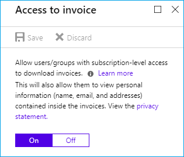
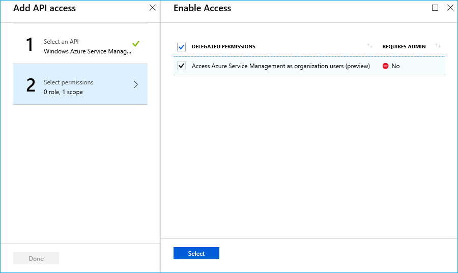

# get-azure-latest-invoice

A sample PowerShell script that shows how to get the most recent Azure invoice.

Azure Billing API を利用し、最新の請求書をダウンロードしてくる PowerShell スクリプトです。

## 請求書へのアクセスの許可

Azure から請求書をダウンロードするためには、事前に請求書へのアクセスをオプトインしておく必要があります。このためまず以下の設定を実施ください。

1. Azure ポータルに管理者でサインインします。
2. 左側のブレードから [All services] を開きます。
3. [Subscriptions] を選択します。
4. [Pay-As-You-Go] などアクセスを許可したいサブスクリプションを選びます。
5. ブレード内の [Invoices] を選択します。
6. 画面中ほどの [Access to invoice] を選択します。
7. 設定を [On] にします。



また、スクリプトを実行するユーザーに対して、[アクセス許可 (IAM)] から [Billing Reader ロール] を付与ください。

## アクセス トークン取得のためのアプリケーション設定手順

Azure AD 上にネイティブ アプリケーションを登録します。すでに登録済みの場合、作成済みのアプリについて同様の設定を実施済みか確認ください。

1. Azure ポータルに管理者でサインインします。
2. [Azure Active Directory] を開きます。
3. [アプリの登録] を選択します。
4. [+ 新しいアプリケーションの登録] を選択します。
5. 名前に任意のもの (例: GetAzureInvoiceApp) を入力し、アプリケーションの種類は [ネイティブ] を設定します。
6. サインオン URL にはアプリの応答 URL (urn:ietf:wg:oauth:2.0:oob) を設定します。
7. アプリを作成したら、そのアプリのアプリケーション ID をメモします。
8. [設定] を選択し、[必要なアクセス許可] を選択します。
9. [+ 追加] から [Windows Azure Service Management API] を選択します。
10. [Access Azure Service Management as organization users (preview)] を選択して保存を押下します。



## アプリの設定内容の変更

GetAzureLatestInvoice.ps1 を開き、以下の箇所を登録したアプリに合わせて変更します。$tenantId を貴社のテナントに、$clientId を登録したアプリの ID に変更ください。$subscription には、請求書を取得したいサブスクリプション ID を指定します。

```powershell
$tenantId = "yourtenant.onmicrosoft.com" # or GUID "01234567-89AB-CDEF-0123-456789ABCDEF"
$clientId = "FEDCBA98-7654-3210-FEDC-BA9876543210"
$redirectUri = "urn:ietf:wg:oauth:2.0:oob"
$resource = "https://management.azure.com"
$subscription = "0123ABCD-4567-89EF-0123-ABCD4567EF89"
```

## アプリの実行

まず、GetAdModuleByNuget.ps1 を実行ください。Tools フォルダーができ、フォルダー内に必要なモジュールが配置されます。本スクリプトは、もう一つの GetAzureLatestInvoice.ps1 の実行に必要なモジュールを取得してくるためのものです。この状態で、事前に内容を貴社に合わせておいた GetAzureLatestInvoice.ps1 を実行します。認証画面が表示されますので、請求書の取得の処理を行いたいユーザー (Billing Reader ロール) でサインインします。

内部的には以下のような Azure Billing API にアクセスしています。

```
GET https://management.azure.com/subscriptions/{subscription id}/providers/Microsoft.Billing/invoices/latest?api-version=2017-04-24-prev  
Authorization: Bearer eyJ0eXAiOi{省略}3lISmxZIn0.eyJhdWQiOi{省略}joiMS4wIn0.FDlzA1xpic{省略}Nj_6yECdIw
```

得られる応答 (読み取り結果) の例は以下のようになります。

```json
{
    "id": "/subscriptions/{subscription id}/providers/Microsoft.Billing/invoices/{name}",
    "type": "Microsoft.Billing/invoices",
    "name": "{name}",
    "properties": {
        "downloadUrl": {
            "expiryTime": "2018-09-24T03:45:17Z",
            "url": "https://billinginsightsstore.blob.core.windows.net/invoices/..."
        },
        "invoicePeriodEndDate": "2018-08-12",
        "invoicePeriodStartDate": "2018-07-13",
        "billingPeriodIds": [
            "/subscriptions/{subscription id}/providers/Microsoft.Billing/billingPeriods/{period id}"
        ]
    }
}
```

スクリプトでは、url から取得したデータを invoicePeriodStartDate と invoicePeriodEndDate の値を組み合わせたファイル名にして保存しています。